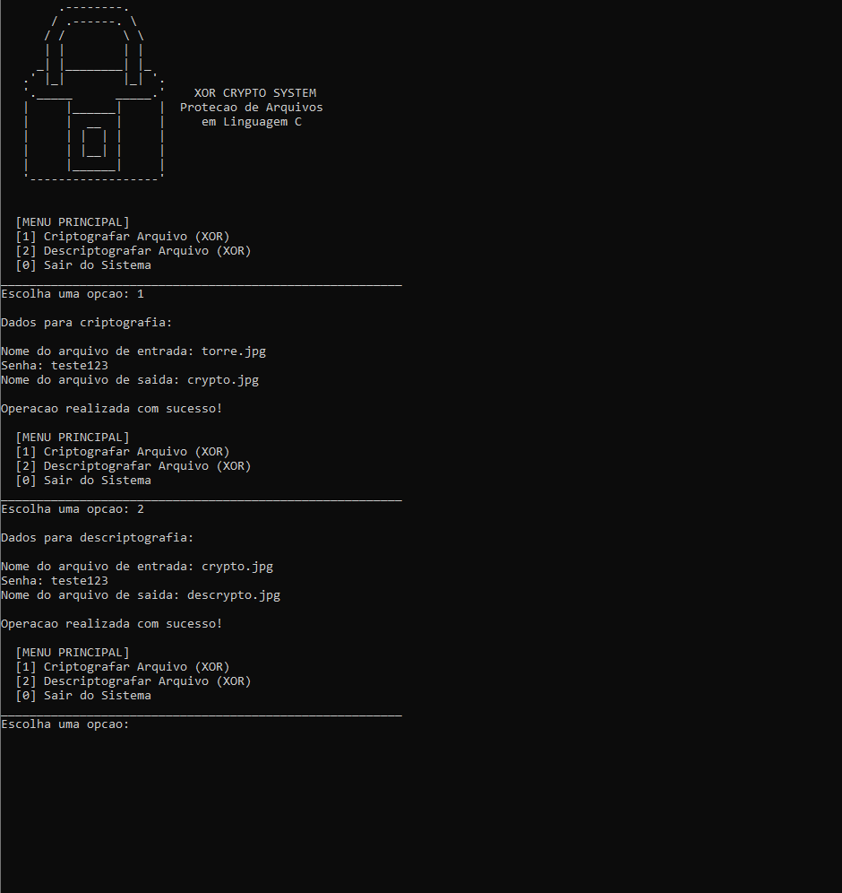
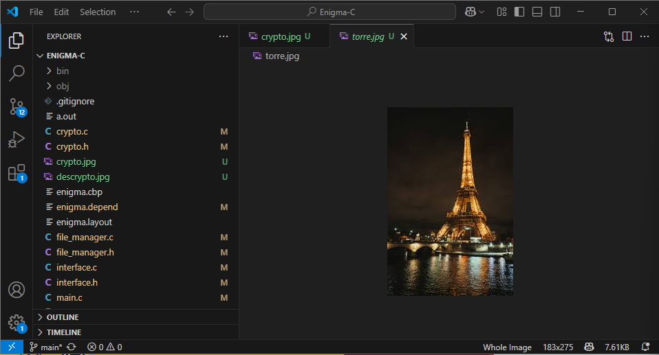
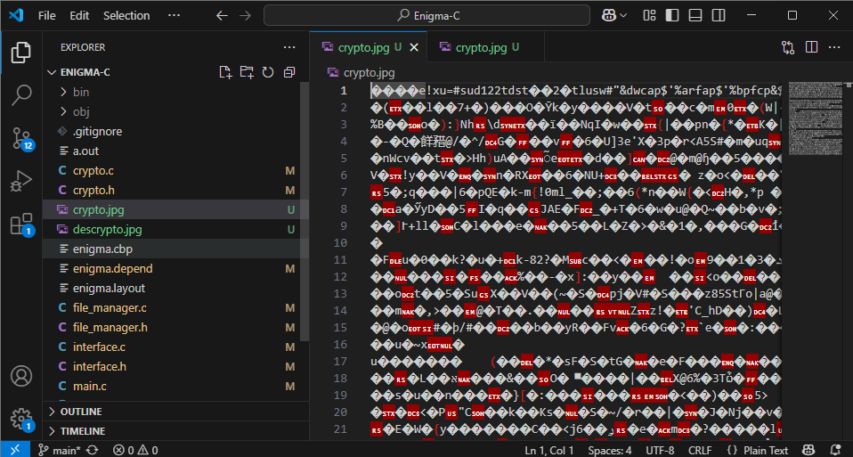
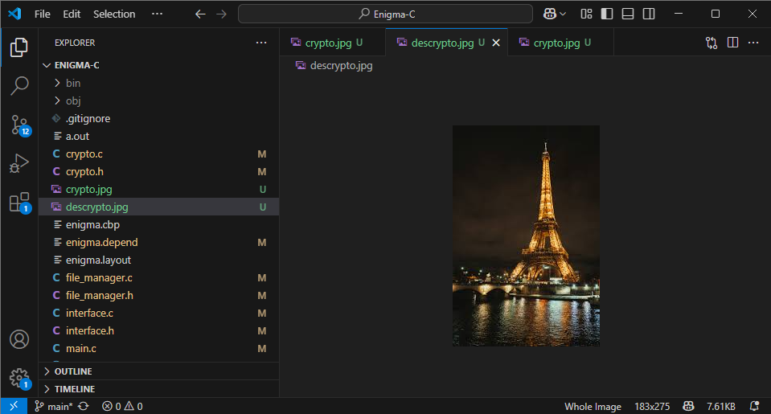

# 🛡️ Enigma-C - Gerenciador de Arquivos com Criptografia

O **Enigma-C** é uma ferramenta de linha de comando desenvolvida em linguagem C para a proteção de dados através de cifragem binária. O projeto foi criado como trabalho final para a disciplina de Algoritmos e Lógica de Programação no IFPB.

## 🚀 Funcionalidades
- **Criptografia Binária:** Protege qualquer tipo de arquivo (txt, pdf, png, etc).
- **Algoritmo Híbrido:** Implementação de XOR dinâmico com deslocamento de bits.
- **Segurança:** Sistema de verificação de integridade via Checksum.
- **Interface Segura:** Entrada de senha mascarada para proteção do usuário.
- **Gestão de Memória:** Alocação dinâmica eficiente com monitoramento de leaks.

## 🛠️ Tecnologias Utilizadas
- **Linguagem:** C (Padrão C11)
- **Compilador:** GCC
- **Bibliotecas Padrão:** `stdio.h`, `stdlib.h`, `string.h`, `time.h`

## Capturas de Tela





## ⚙️ Como Compilar e Rodar
Para compilar o projeto, certifique-se de ter o GCC instalado e execute:

```bash
gcc *.c -I include -o enigma-c
